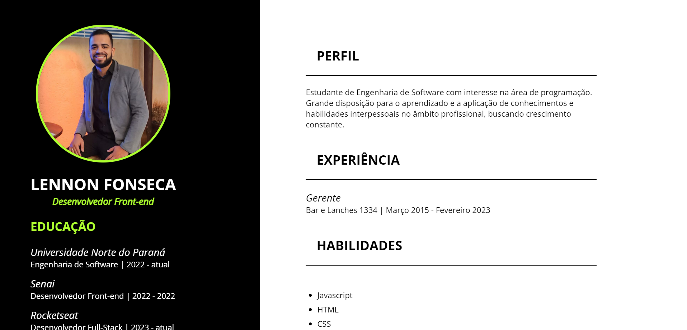

<h1 align="center"> Currículo para mobile e Web </h1>

Currículo responsivo no qual trabalhei para ensino de tecnologias WEB.

  <a href="#-tecnologias">Tecnologias</a>&nbsp;&nbsp;&nbsp;|&nbsp;&nbsp;&nbsp;
  <a href="#-projeto">Projeto</a>&nbsp;&nbsp;&nbsp;|&nbsp;&nbsp;&nbsp;
  <a href="#-layout">Layout</a>&nbsp;&nbsp;&nbsp;|&nbsp;&nbsp;&nbsp;
  <a href="#memo-licença">Licença</a>

  

 

  

[🔗 Clique aqui para acessar](https://devleuuon.github.io/curriculo/)

## 🚀 Tecnologias

Esse projeto foi desenvolvido com as seguintes tecnologias:

- HTML e CSS
- Git e Github

## 💻 Projeto

Projeto responsivo para melhorar a prática e os conhecimentos.
## 🔖 Layout

Layout desenvolvido por mim mesmo.

## 📝 Licença

Esse projeto está sob a licença MIT.